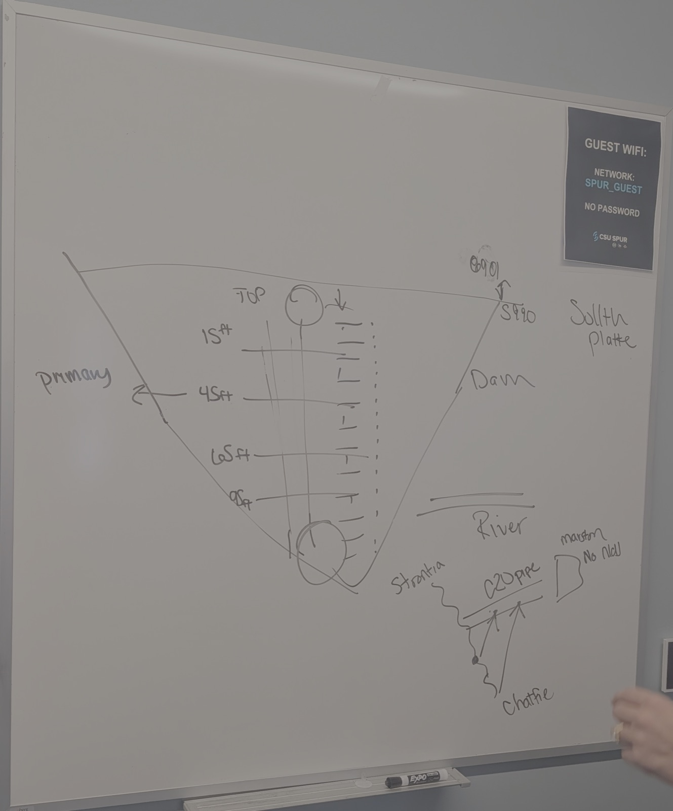

# Q&A panel with Cassidi — notes

Notes from the Q&A panel with Cassidi Rosenkrance (Denver Water) on 2026-09-24,
with one point from Jake, plus a later follow-up with Jake and Cassidi on
alkalinity, TOC, and dosing. These are our notes, not a transcript or anything
Denver Water wrote. Where a note is ambiguous, it says so rather than guessing
what was meant.

## The problem, in her words

- **The biggest problem is no visualization.** They have the data and can
  interpolate it, but they can't *see* it. They want to explain different
  conditions across the organization.
- **They have past and current data; they want future predictions.**
- **They need help making decisions.** Not more data: support for choosing what
  to do.

## Water rights are the #1 issue

- Water rights are the top issue. Denver Water has to provide water downstream
  of Denver.
- Water Quantity uses barometric data to answer "what water might we see this
  year?", but not at any finer grain than the year.
- **Public perception is part of the problem.** People complain about being
  under water restrictions while parks are watering, or while Denver Water is
  flushing hydrants. Flushing is needed so water quality doesn't go down, but
  from the street it looks like waste.

## Three personas

| # | Who | What they care about |
|---|---|---|
| 1 | **Water Quantity / Water Rights** (about 50 people) | How much water there will be, and meeting rights obligations |
| 2 | **Water Quality team** | Regulations |
| 3 | **Treatment plants** | Treating efficiently and at low cost. Chemicals are expensive. |

## The 2023 storm

In 2023 a 100-year storm hit the South Platte. Turbidity rose so sharply the
plant almost had to shut down. The sediment clogged the filters; they ended up
treating with chemicals, but the filters were already clogged.

Our takeaway, not something she said: by the time turbidity reaches the plant, it is too late to
react. Warning ahead of arrival is what would have helped.

## Facts about the system and data

- **All sensors have lat/long** for their location.
- **Jake: there are 4 gates up through the reservoir.** Cassidi's whiteboard
  sketch (below) answers this: they are intake gates at different depths in
  Strontia Springs Reservoir.

## Cassidi's whiteboard: Strontia Springs Reservoir by depth

Our reading of a sketch Cassidi drew, photographed by the team. It is a sketch,
not a drawing to scale.

- **Intakes at the top and at 15, 45, 65 and 95 ft.** The top intake plus four
  gates matches Jake's "4 gates".
- **45 ft is the primary gate, and they like it there.** The sketch doesn't say
  why.
- **The profiling sonde hangs from a buoy on a line down the water column** beside
  the gates, so its readings are the water at the intake.
- **Two numbers at the top of the dam: 6001 and 5990.** Probably elevations in
  feet (full pool and a water level?). Unconfirmed.
- **Downstream: Strontia → "C20 pipe" → Marston, with Chatfield also drawn.** Our
  map draws Conduit 26 to Foothills; the sketch shows a second route we haven't
  mapped. A note by Marston is illegible in the photo.

What we found when we checked the sonde against it (our analysis of
`data/Strontia 0407_0819.xlsx`, 357 full casts, 2026-04-07 to 08-19, depths read as
metres and converted to feet):

- **By turbidity alone, 45 ft is rarely the clearest gate:** the top was clearest
  in 68% of casts and 45 ft in 1%. So their preference rests on something other
  than turbidity. Our guess, general knowledge rather than theirs: cooler, steadier
  water below the algae near the surface and above low-oxygen water near the bottom.
- **Some weeks a murky layer sat right on the 45 and 65 ft gates:** late July, and
  Aug 17 to 19 (about 5.7 NTU at 45 ft against 1.4 at the top). The River map's
  gate panel flags weeks like these rather than recommending a gate.

## Alkalinity, TOC, and the alum dose (follow-up with Jake and Cassidi)

- **The alkalinity sweet spot is 50 to 80** (units not stated; Denver Water's data
  reports alkalinity in mg/L).
- **The state mandates how much TOC must be removed, based on alkalinity**, and
  the requirement changes at **60**. This answers the question in
  the below-60 classifier section of [`guide.md`](../../guide.md): 60 is a
  regulatory line, not just a round number.
- **Why alkalinity matters:** the coagulant chemicals that form floc are acidic.
  If alkalinity is too low, the water can't buffer them, pH drops out of the
  range where floc works, and they can't trap TOC.
- **There's a "happy range" of pH for floc to work.**
- **Above 60 is a tradeoff:** they are required to remove less TOC, but then
  they're fighting alkalinity. (Our reading: more buffering means more acid, or
  more coagulant, to bring the pH down into the floc range.)
- **Today's tool is an Excel sheet.** Operators plug in the incoming TOC and it
  gives a target coagulant dose. Example given: 3 mg of TOC coming in targets
  about **11 of aluminum sulfate (alum)**. Our notes say "11 g"; a dose would
  normally be in mg/L, so treat the unit as unconfirmed.
- **What they want: something plug-and-play**, which we read as: give it the
  predicted incoming TOC and alkalinity, get a dose recommendation. That reading
  is ours; confirm it.

**General knowledge, not from Jake or Cassidi; check it against
`reference/DBP-PRE and DBP Rule Training Slides_DDD conference.pdf`:** the rule
this sounds like is the EPA Stage 1 Disinfectants/Disinfection Byproducts Rule's
*enhanced coagulation* requirement, which Colorado enforces. It sets the required
percent TOC removal from a table of source-water TOC against source-water
alkalinity, with alkalinity bands of 0–60, >60–120, and >120 mg/L as CaCO3. Higher
alkalinity means a lower required percentage. We have not verified the exact
percentages here, so don't put numbers from it into prompts until someone reads
the slides.

## Open questions to follow up on

- Is the alum example 11 mg/L? Is it per 3 mg/L of TOC at a particular
  alkalinity, or does the Excel sheet take alkalinity as an input too?
- Could we get a copy of the Excel sheet (or its formula)? It is the thing a
  plug-and-play tool would replace or wrap.
- What is the "happy range" of pH for floc at Foothills?
- Are the gate depths (15, 45, 65, 95 ft) measured from the water surface or from
  full pool? It decides where each gate sits against the sonde's readings.
- Why is 45 ft the preferred gate? Temperature, algae, manganese, something else?
- What are 6001 and 5990 on the sketch, and where does the C20 pipe go?
- What does "barometric" mean for Water Quantity's forecast: barometric pressure,
  or another measure recorded under that name?
- Which downstream obligations drive the water rights problem, and on what
  timescale do they bind?
